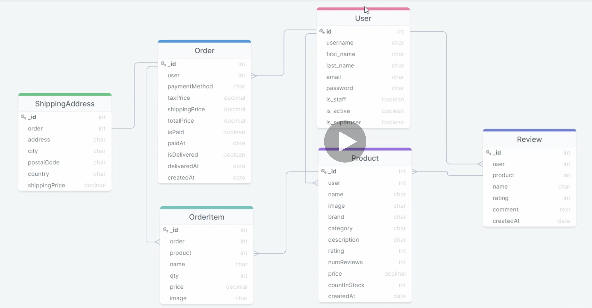
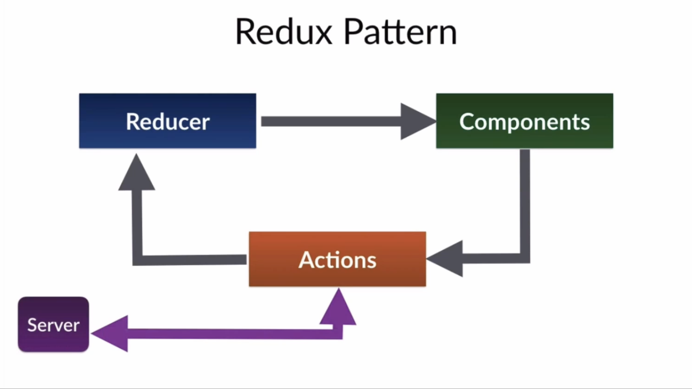

# full-stack-ecommerce-website
A full-stack E-commerce website built using React, Redux, Django &amp; PostgreSQL

## Building the frontend
- Install node
- Install css theme from https://bootswatch.com/

## Building the backend
- `django-admin startproject backend`
- `python manage.py startapp base`
- `python manage.py createsuperuser`
- DB structure

- `python manage.py makemigrations`
- `python manage.py migrate`

## Overview of Redux

- Redux is for global state
- Passing state through props can get messy
- Eg: authenticated user, what's in the cart
- State is changed through reducers. Reducers are responsible for manipulating the state and passing it down to components
- Actions are objects that represent the intention to change a state. We have action creators that fire off those actions